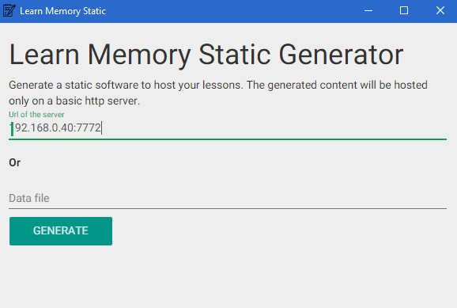

# Learn Memory Static Generator

Generate a static software to host your lessons. The generated content will be hosted only on a basic http server.



## Installation

1. [Download](https://github.com/cedced19/learn-memory-static-desktop/releases/latest)
2. Extract
3. Execute `learn-memory-static.exe`

## Dev

```
$ npm install
```

### Run

```
$ npm start
```

### Build the app

```
$ npm run build
```
